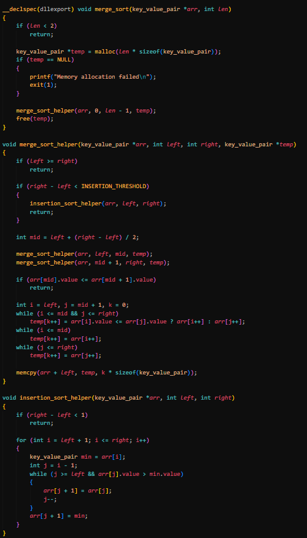
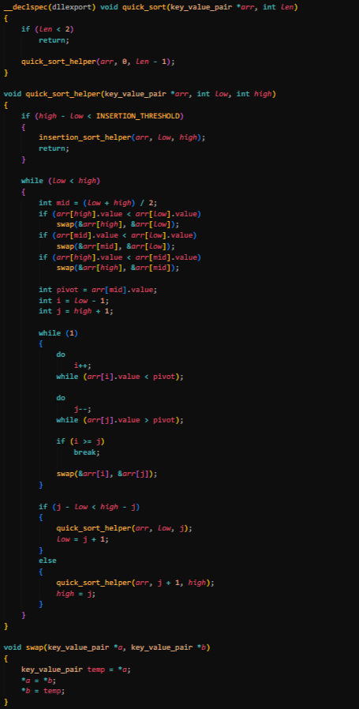
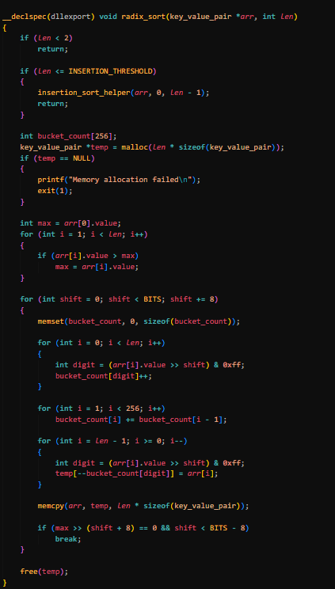
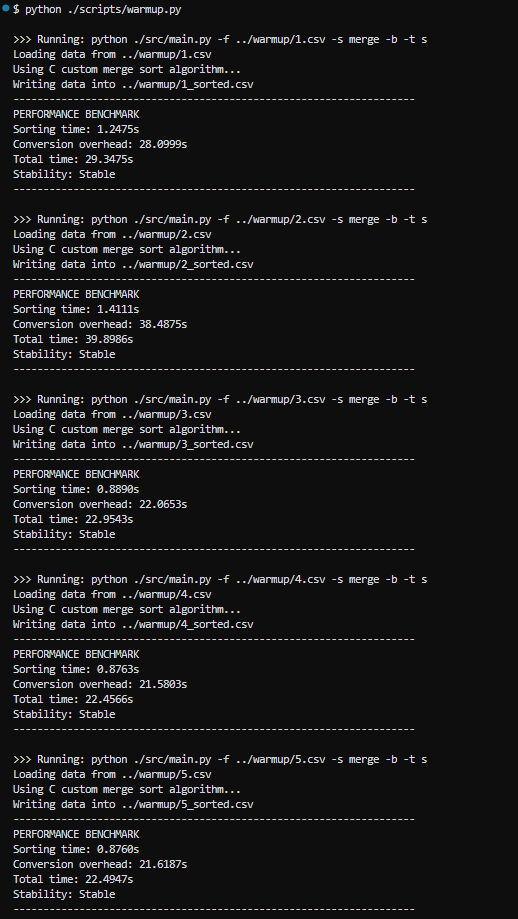
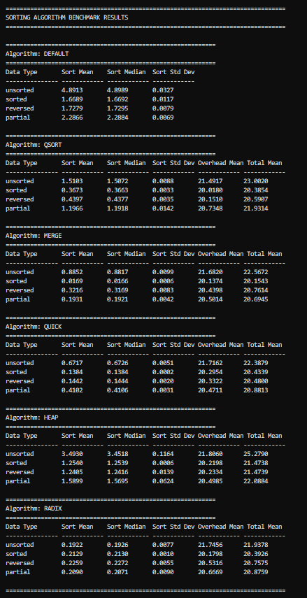
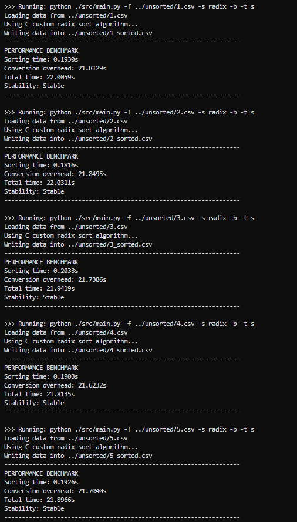
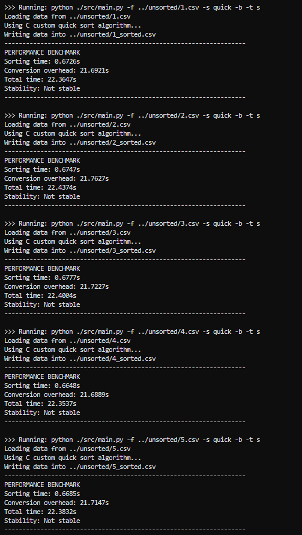
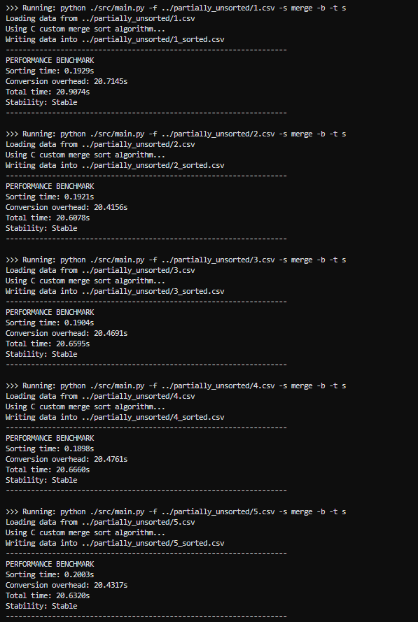

# Python CLI with Integrated C Sorting Algorithms for Practical, Large-Scale Data and Performance Benchmarking

> Leveraging Python's convenience and C's raw processing speed.

> Video Demo: <URL HERE>

---

## Table of Contents

-   [Introduction](#introduction)
-   [Tech Stack](#tech-stack)
-   [System Architecture](#system-architecture)
-   [Python CLI Controller](#python-cli-controller)
-   [Python & C Integration](#python--c-integration)
-   [C Sorting Algorithms](#c-sorting-algorithms)
-   [Data Structure](#data-structure)
-   [Performance Benchmarking](#performance-benchmarking)
-   [User Guide](#user-guide)
-   [Results & Observations](#results--observations)
-   [Changelog](#changelog)
-   [Limitations & Future Work](#limitations--future-work)
-   [Conclusion](#conclusion)
-   [Appendix](#appendix)
-   [Acknowledgements](#acknowledgements)
-   [Licence](#licence)

---

## Introduction

For the CS50 final project, the aim was to build a foundational tool that bridges theoretical concepts with practical software development. The result is a Python CLI controller with integrated C sorting algorithms, a minimal system that connects two languages while exploring essential computer science principles. This project serves three core educational goals:

-   System Integration: Connecting Python's high level convenience and C's low-level performance and raw processing speed with Python's built-in module
-   Algorithms Fundamentals: Implementing and comparing multiple sorting algorithms (Merge, Quick, Heap, Radix) to understand practical optimisations, time and space complexities and stability
-   Performance Analysis: Building a performance benchmark, gaining insight into real-world performance characteristics and exploring trade-offs

The system architecture demonstrates important concepts in a straightforward way which are modular design, user interface, file handling, cross-language integration, data conversion, compiled library, performance measurements, external scripts and automation.

---

## Tech Stack

-   Programming Languages: **Python**, **C**
-   Compiler: **GCC (MinGW)**
-   Version Control: **Git**
-   Remote Repository Hosting: **GitHub**
-   Integrated Development Environment: **Visual Studio Code**

---

## System Architecture

The system follows a modular architecture:

-   Python CLI Controller: User interface, file handling, C integration, performance benchmark (main.py)
-   C Core Layer: Optimised sorting algorithms (program.dll)
-   Data Generation: Python script to generate CSV data files for testing (generate.py)
-   Performance Testing: Automated benchmarking (warmup.py, run.py)

---

## Python CLI Controller

The Python CLI controller handles:

-   Argument Parsing: Supports file and algoritm selection, enable benchmarking and time unit selection
-   File I/O: Reads CSV data file into Python list, writes sorted rows back into a new CSV
-   C Integration: Manages C library loading and data structures, enable C-compatible arrays and function calling
-   Performance Benchmark: Measures and display results on the terminal

## Python & C Integration

Python ctypes is used as a built-in module that allows Python code to call functions and access data structures in shared libraries (DLLs on Windows, .so files on Linux, .dylib on macOS). It essentially let Python interacts with C code.

---

## Sorting Algorithms

### Python Default (sorted)

-   Timsort, a hybrid, stable sorting algorithm derived from merge and insertion sort
-   Timsort is designed to perform well on many kinds of real-world data
-   Time complexity: O(n log n), O(n) (Best case)
-   Space complexity: O(n)
-   Stability: Stable

### C Default (qsort)

-   Portable sorting function
-   Time complexity: O(n log n)
-   Space complexity: O(log n)
-   Stability: Not stable

### Merge Sort

-   Divide & conquer
-   Sorts left side and right side recursively, then merge while backtracking
-   Time complexity: O(n log n), O(n) (Best case)
-   Space complexity: O(n)
-   Stability: Stable
-   Optimisation:
    -   Insertion sort for small subarrays
    -   Single temporary memory allocation
    -   Early exit for sorted subarrays
    -   `memcpy` for large data implementation
-   Code snippet:



### Quick Sort

-   Divide & conquer
-   Sorts elements relative to pivot element, then recursively sorts each side
-   In-place sorting
-   Time complexity: O(n log n), O(n^2) (Worst case)
-   Space complexity: O(log n)
-   Stability: Not stable
-   Optimisation:
    -   Insertion sort for small subarrays
    -   Median of three pivot
    -   Hoare partition scheme
    -   Tail recursion elimination
-   Code snippet:



### Heap Sort

-   Builds max-heap on parent indexes (1st phase)
-   Repeatedly sorts largest element at the end, at the same time builds smaller max-heap (2nd phase)
-   In-place sorting
-   Time complexity: O(n log n)
-   Space complexity: O(1)
-   Stability: Not stable
-   Optimisation:
    -   Insertion sort for small subarrays
    -   D-ary heap
    -   Hybrid second phase
    -   Iterative heapify
-   Code snippet:


### Radix Sort

-   Sorts elements by processing individual digits or bits
-   A non-comparative sorting algoritm
-   Time complexity: O(n \* k)
-   Space complexity: O(n)
-   Stability: Stable
-   Optimisation:
    -   Insertion sort for small subarrays
    -   Single temporary memory allocation
    -   Counting sort
    -   Bit operations
    -   `memset` for fast bucket zeroing
    -   `memcpy` for large data implementation
-   Code snippet:



---

## Data Structure

-   CSV data file containing key and value pair of ID and integer is used for testing
-   Example: `ID1001, 67`
-   Data set size and state from python script (generate.py):
    -   10k, 250k, 1M, 10M
    -   unsorted, sorted, reversed, partially unsorted

---

## Performance Benchmarking

The Python CLI controller measures:

-   Data conversion time (Python list - C array)
-   Pure sorting time
-   Total time (sorting and overhead)
-   Stability check

---

## User Guide

> [!NOTE]
> This is a simple, manual way to execute the project with example.

-   Build C library:

    ```
    make program
    ```

-   Generate CSV data file:

    ```
    python ./scripts/generate.py --length 10000000 --state unsorted --output ./tests/10M.csv
    ```

-   Warm up cache to avoid cold start anomalies:

    ```
    python ./scripts/warmup.py
    ```

-   Run main program:

    ```
    python ./src/main.py -f ./tests/10M.csv -s radix -b -t s
    ```

-   Or run automated test:

    ```
    python ./scripts/run.py
    ```

---

## Results & Observations

### Results

-   Cache Warmup (warmup.py) (~3min)



-   Performance Benchmarking (run.py) (~1hour)



### Observations

-   For CSV data file with unsorted 10 million rows, Radix sort performed the fastest (0.1922s) with 25.4x speedup relative to Python's sorted (4.8913s), while Quick sort is the second fastest (0.6717s) with 7.3x speedup but at the cost of stability

-   However, total time including Python-to-C conversion overhead causes it to experience 4.5x and 4.6x slowdown for both Radix and Quick sort respectively





-   Merge sort (without Python overhead) is the fastest (0.1931s) for partially unsorted data with 11.8x speedup relative to Python's sorted (2.2866s)



-   Heap sort (3.4930s) only gain 1.4x speedup relative to Python's sorted (4.8913s)

> [!NOTE]
> Optimisation flags (-O3 -march=native -flto -funroll-loops) are used to further improve sorting algorithms during compilation

---

## Changelog

### [v1.0] - 2025-12-24

-   Update performance benchmark for testing
-   Refactor main.py for readability
-   Add test folders for all data state
-   Add Python scripts to automate warmup and testing ([src](src))
-   Add performance benchmark results and C sorting algorithms code snippets ([public](public))
-   Provide full documentation for the project

### [v0.9] - 2025-12-23

-   Add quick and heap sorting algorithms
-   Optimise program.dll through compiler flags

### [v0.8] - 2025-12-22

-   Refactor main.py and program.c
-   Add qsort, merge and radix sort for C sorting algorithms in Python CLI controller
-   Add time measurement (ns) from Python module for performance benchmark

### [v0.7] - 2025-12-21

-   Integrate custom C program with Python CLI controller

### [v0.6] - 2025-12-20

-   Add working prototype for Python CLI controller
-   Add Python script to generate CSV data files for testing

### [v0.5] - 2025-12-17

-   Add quick, heap, radix sorting algorithms
-   Optimise all sorting algorithms
-   Refactor test algorithms

### [v0.4] - 2025-12-8

-   Add basic tests for C sorting algorithms (bubble, selection, insertion, merge)

### [v0.3] - 2025-12-7

-   Add Python and C boilerplates
-   Update Makefile for C build compilation

### [v0.2] - 2025-12-6

-   Add src directory ([src](src))
-   Add tests directory ([tests](tests))
-   Add Makefile text file ([Makefile](Makefile))

### [v0.1] - 2025-09-02

-   Initialise Git repository
-   Add MIT licence ([LICENSE](LICENSE))
-   Add initial documentation draft ([README.md](README.md))

---

## Limitations & Future Work

### Limitations

-   CSV data files are not included in the repository due to size limit
-   Due to time constraint, only CSV data files with 10M are used with 5 runs per data state for each sorting algorithms
-   Sorting algorithms only handle ascending sorting for integer values from second column of CSV data file

### Future Work

-   Refactor warmup.py, run.py for functionality
-   Integrate C code with different approaches, bypassing Python-to-C conversion overhead
-   Refactor main.py for scalability
-   Explore Python modules to utilise it fully
-   Build full automation pipeline with benchmarking results
-   Build custom C Timsort sorting algorithm
-   Implement parallel sorting, leveraging CPU cores

---

## Conclusion

This CS50 final project successfully builds a Python CLI with integrated C sorting algorithms, creating a practical tool that connects theoretical concepts to real-world software development. While Python-to-C conversion overhead slowed down the integrated system, causing the micro-optimisations to be negated by macro-inefficiencies, the custom C sorting algorithms themselves proved faster than Python’s default `sorted()` and C’s default `qsort()`, demonstrating the performance benefits of optimised low-level C code. Through implementing and benchmarking Merge, Quick, Heap, and Radix sorts, the project provides insight into optimising algorithms for time, space, and stability while building practical skills in cross-language integration, modular system design, and performance measurement. The result is a functional system that demonstrates foundational software engineering principles in action.

---

## Appendix

### Bubble Sort

-   Repeatedly builds largest element at the end by comparing adjacent elements at the beginning
-   Time complexity: O(n^2), O(n) (Best case)
-   Space complexity: O(1)
-   Stability: Stable

### Selection Sort

-   Repeatedly builds minimum element at the beginning by iteratively comparing unsorted portion
-   Time complexity: O(n^2)
-   Space complexity: O(1)
-   Stability: Not stable

### Insertion Sort

-   Repeatedly inserts the next element into the correct sorted position
-   Time complexity: O(n^2)
-   Space complexity: O(1)
-   Stability: Stable

### Time and Space Complexity

-   Time and space complexities are basically growth indicators to show algorithm performance
-   Time complexity measures the execution time efficiency of an algorithm relative to its input size
-   Space complexity measures the memory usage efficiency of an algorithm relative to its input size
-   Common notations (Big O):
    -   O(1): Constant regardless of input size
    -   O(log n): Logarithmic
    -   O(n): Linear
    -   O(n log n): Linearithmic
    -   O(n^2): Quadratic
    -   O(2^n): Exponential
    -   O(n!): Factorial

### Stability

-   A stability is used to determine the behaviour of sorting algorithms
-   A stable sorting algorithm is where two objects with equal keys appear in the same order in sorted output as they appear in the input data set

---

## Acknowledgements

### Credits

-   Eternal gratitude to God, the Most Gracious, the Most Merciful.
-   Many thanks to Prof. David J. Malan and CS50 staff for providing such an amazing course on introduction to computer science for free to everyone.

### References

-   https://www.w3schools.com/
-   https://docs.python.org/3/
-   https://www.sortvisualizer.com/
-   https://www.geeksforgeeks.org/dsa/stable-and-unstable-sorting-algorithms/
-   https://en.wikipedia.org/wiki/Timsort

---

## Licence

This project is licensed under the [MIT Licence](LICENSE).
